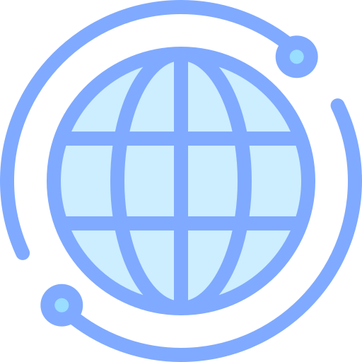

### Hi there, I'm Kevin 🌌

## I'm a Developer, Engineer and Entrepreneur!!

- 🌱 I believe in lifelong learning 
- 🌎 I'm from Trinidad and Tobago 
- 👽 I love connecting with people and sharing experiences
- ❤️ My passion is aerospace 🚀 and robotics 🤖
- ⚡ Fun facts: I love dragon boat racing and playing the steel pan
- 🥅 2022 Goals: Graduate with a degree in Electrical and Computer Engineering

### Connect with me:

[][website]
[][linkedin]

 

### Top Technologies:

 

### Languages and Tools:

 
 

---

[website]: https://sites.google.com/kmsankar.com/home
[linkedin]: https://linkedin.com/in/kevin-sankar-6317971b8
